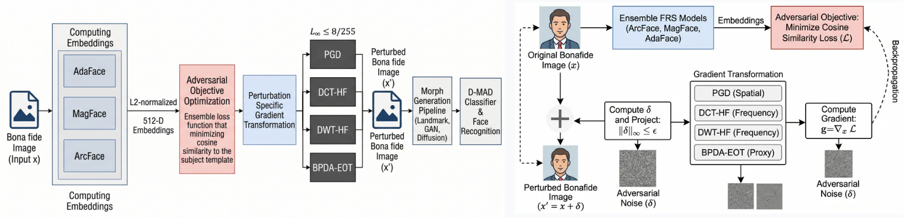

# Trusted but Tainted

**Official implementation of**

**Trusted but Tainted: Enrolment Perturbations that Undermine Morphing Attack Detection and Face Recognition**

Accepted at **ICPR 2026**.

---

## Overview

Trusted but Tainted investigates adversarial enrolment perturbations that simultaneously:

* Increase Morphing Attack Potential (GMAP)
* Undermine Differential Morphing Attack Detection (D-MAD)

The repository provides a complete evaluation pipeline covering:

* Adversarial Perturbation Generation
* Morph Generation
* Face Recognition Evaluation
* Embedding Extraction
* Delta Embedding Generation
* GMAP Evaluation
* D-MAD Evaluation

---

## Pipeline

<p align="center">
  
</p>

The proposed framework generates adversarial enrolment perturbations using an ensemble of face recognition systems and evaluates their impact on both morphing attack success and morphing attack detection.

---

## Supported Face Recognition Systems

* AdaFace
* ArcFace
* MagFace
* ElasticFace
* EdgeFace

---

## Supported Perturbations

* PGD
* DCT-HF
* DWT-HF
* BPDA-EOT

---

## Supported Morph Generators

* Greedy
* MIPGAN-II
* UBO

---

## Datasets

Experiments are conducted using:

* FERET
* FRGC

Please cite the original dataset publications when using this work.

---

## Repository Structure

```text
Trusted_but_Tainted/

├── notebooks/
├── Dataset/
├── models/
├── repos/
├── image-output/
├── Embeddings/
├── Embeddings_Diff/
├── GMAP_Results/
├── DMAD_Results/
├── assets/

├── README.md
├── LICENSE
├── requirements.txt
├── CITATION.cff
└── .gitignore
```

---

## Installation

Clone the repository:

```bash
git clone https://github.com/dhammadipdk/Trusted_but_Tainted.git
cd Trusted_but_Tainted
```

Install dependencies:

```bash
pip install -r requirements.txt
```

Tested with:

* Python 3.10+
* PyTorch
* CUDA-enabled GPU (recommended)

---

## Notebook Overview

| Notebook                                | Description                                         |
| --------------------------------------- | --------------------------------------------------- |
| 00_setup.ipynb                          | Environment setup and repository initialization     |
| 01_generate_perturbations.ipynb         | Adversarial enrolment perturbation generation       |
| 02_morph_generation.ipynb               | Morph generation using Greedy, MIPGAN-II, and UBO   |
| 03_embedding_and_delta_embeddings.ipynb | Embedding extraction and delta embedding generation |
| 04_gmap_evaluation.ipynb                | GMAP evaluation                                     |
| 05_dmad_evaluation.ipynb                | D-MAD evaluation                                    |

---

## Reproducibility

### Full Reproduction

Execute the notebooks sequentially:

```text
00_setup.ipynb
↓
01_generate_perturbations.ipynb
↓
02_morph_generation.ipynb
↓
03_embedding_and_delta_embeddings.ipynb
↓
04_gmap_evaluation.ipynb
↓
05_dmad_evaluation.ipynb
```

This mode requires access to the original datasets and model checkpoints.

### Demo Reproduction

A self-contained Demo Inference Package is provided to allow execution of the complete pipeline on a reduced benchmark.

The package includes:

* FERET subset
* FRGC subset
* Face recognition checkpoints
* External repositories
* Generated perturbations
* Morphs
* Embeddings
* Delta embeddings
* Evaluation assets

allowing users to validate the complete workflow without additional setup.

---

## Artifact Downloads

### Demo Inference Package

Whole subset inference assets, datasets, models, repositories, embeddings, results, and notebooks.

[GDrive](https://drive.google.com/drive/folders/1mhzZrRXpiKOIrTRSeU5_6lwmtxU68BHA?usp=sharing)

---

## Acknowledgements

This repository builds upon the following face recognition systems:

* AdaFace
* ArcFace
* MagFace
* ElasticFace
* EdgeFace

and uses the following datasets:

* FERET
* FRGC

We gratefully acknowledge the authors of the original face recognition systems, morph generation frameworks, and datasets used throughout this work.

Please cite the corresponding publications and repositories when using this repository.

---

## Citation

If you use this repository, please cite:

```bibtex
@inproceedings{kamble2026trusted,
  title={Trusted but Tainted: Enrolment Perturbations that Undermine Morphing Attack Detection and Face Recognition},
  author={Kamble, Dhammadip and others},
  booktitle={International Conference on Pattern Recognition (ICPR)},
  year={2026}
}
```

The citation entry will be updated after publication.

---

## Contact

Dhammadip Kamble

GitHub: https://github.com/dhammadipdk
